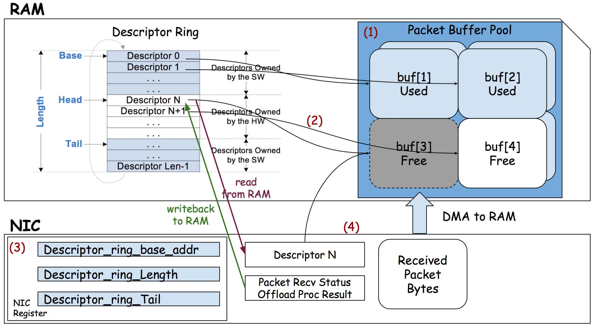

# Introduction

It is absolutely necessary to have effective data management in order to achieve maximum performance and usage of resources in computer systems. When it comes to this domain, one of the most significant challenges is the creation of data structures that enable the transfer of data between components in a quick and dependable manner, notably between network interface controllers (NICs) and central processing units (CPUs). In order to overcome this obstacle, the ring buffer is a fundamental data structure that is widely utilized in real-time systems and networking.

During the course of this project, our major objective is to develop and implement a ring buffer that is specifically adapted to the interaction that occurs between NICs and CPUs. A number of essential requirements must be satisfied by this ring buffer:

The process of ensuring that data storage and retrieval are both efficient and reliable in order to facilitate communication that is seamless between the NIC and the CPU.
Making it possible for data to flow without interruption in both directions by facilitating both transmitting and receiving processes.
Facilitating seamless integration with pre-existing network interface controller (NIC) and central processing unit (CPU) architectures in order to minimize overhead and maximize performance.
In order to ensure that the ring buffer implementation is both valid and functional, it is necessary to implement a stringent verification method.
In order to accomplish these goals, we make use of previously conducted research and established best practices in the field of data structure design, with a particular emphasis on the specific requirements of NIC-CPU connection. We have developed a method that combines theoretical principles with practical implementation techniques in order to produce a ring buffer solution that is both reliable and effective. The purpose of our implementation is to confirm the effectiveness and reliability of our implementation in real-world settings by means of comprehensive testing and verification. This will ensure that data flow between NICs and CPUs is carried out without any obstacles.

There is two kinds of operations that happens over PCIe. DMA and MMIO.

**MMIO:** A portion of the NIC memory is mapped in the Host memory.
Host can read and write to that memory. When host write to that
memory it generates a MMIO write transaction and data is reached
to NIC memory. when host reads from it a MMIO read transaction
is generated and host gets the data from the NIC. MMIO is used
to read/write small data from/to the NIC. Typically it is 32bit
or 64bit value.

**DMA:** Host gives access a portion of the memory to the NIC. Then
NIC can do DMA read to read from that memory and DMA write to
write into that memory. DMA is used to read/write larger values,
for example 1KB, 4KB etc.

**Packet buffers:** A packet buffer is a piece of memory where transmitting
and received packets are kept. There is two packet buffers. Transmit buffer(TX buffer),
where host keeps the packets that will be transmitted. And receive buffer(RX buffer),
where NIC pushes packet that are received.

**Descriptor ring buffer:** It's a ring buffer that points to the packet buffers.
There is two descriptor ring buffer. RX ring buffer. Each entry in the buffer,
points to packet in the RX buffer. And TX ring buffer. Each entry points to
a packet in TX buffer. As these are ring buffers there is head and tail pointer
for each of the rings. These pointers are kept in NIC memory.

### How a Packet is sent (Transmit path) ###

1. CPU write the packet in the TX packet buffer.
2. Create a descriptor with the address to the packet in the TX packet buffer.
3. Writes the descriptor in the TX descriptor ring buffer.
4. Increments the tail pointer with MMIO write.
5. NIC agents see that the tail pointer increased that means CPU wants to transmit a new packet.
6. NIC does a DMA read to read the descripotr in current head.
7. NIC does a DMA read in the packet buffer address found in the descriptor to read the packet.
8. Transmit the packet.
9. Increments the head pointer to singnal the CPU that the packet is sent.
10. CPU reads the head pointer through MMIO read and sees that it is incremented meaning the packet is sent.

### How a packet is received (Receive Path) ###

1. NIC receives a packet.
2. NIC does a DMA write to write the packet in the RX packet buffer.
3. NIC does a DMA write to write the descriptor to the packet in the RX descriptor ring.
4. Increments the RX ring buffer tail pointer to signal host that a new packet is received.
5. Host does MMIO read to read the RX ring buffer tail pointer and sees that it is incremented
   meaning a new packet if received.
6. Host then increments the head pointer through MMIO write.
7. NIC sees the new head pointer, meaning host received the packet.

## Glossary ##

1. **DMA (Direct Memory Access):**

   - DMA is a mechanism that allows hardware devices, like the NIC, to access system memory (kernel memory) directly without involving the CPU.
   - In the context of networking, DMA enables the NIC to transfer data to and from the kernel memory without CPU intervention, which improves system performance.
   - When data arrives at the NIC, instead of involving the CPU to transfer it to kernel memory, the NIC's DMA controller handles the transfer directly.
   - This process offloads the data transfer task from the CPU, allowing it to focus on other tasks while data is being transferred between the NIC and kernel memory.

2. **MMIO (Memory-Mapped I/O):**

   - MMIO is a method for accessing hardware devices, such as the NIC, as if they were memory-mapped locations.
   - In MMIO, certain addresses in the system's address space are reserved for communicating with hardware devices.
   - When the CPU wants to communicate with a hardware device, it reads from or writes to these memory-mapped addresses, triggering operations on the device.
   - MMIO is commonly used for configuring and controlling hardware devices, such as programming the NIC with network settings or initiating data transfers.

**Process with DMA and MMIO:**

**Data Reception (NIC to Kernel Memory):**

- Data arrives at the NIC from the network.
- The NIC's DMA controller, using MMIO, accesses the receive ring buffer in kernel memory directly.
- The NIC writes the incoming data directly to the receive ring buffer using DMA.
- Once the data transfer is complete, the NIC may raise an interrupt to notify the CPU of the newly received data.

**Consumption by Kernel:**

- Upon receiving the interrupt or polling the receive ring buffer, the CPU's kernel processes the received data.
- The kernel parses and analyzes the data, performing necessary networking operations (e.g., protocol handling, packet filtering).
- If further processing is required, the kernel may copy the data from the receive ring buffer to other kernel data structures.

**Data Transmission (Kernel Memory to NIC):**

- When the CPU needs to transmit data, it places the data into the transmit ring buffer in kernel memory.
- The NIC's DMA controller, using MMIO, accesses the transmit ring buffer directly.
- The NIC reads the data from the transmit ring buffer using DMA and sends it out over the network.
- Once the transmission is complete, the NIC may raise an interrupt to notify the CPU.

In this process, DMA and MMIO work together to facilitate efficient data transfer between the NIC, CPU, and kernel memory, while the producer-consumer model ensures synchronized and efficient communication.

# Status

Currently, the project is in the implementation phase. We have successfully designed and implemented the core functionalities of the ring buffer, including transmit and receive operations. However, there are still several areas that require further refinement and optimization. We have used both Python and Forge to model different scenarios. In Python, we implemented six test cases to verify our model and ran those test cases for 10000 different packets. We found out the scenarios where our test cases fail i.e. the model fails to perform as expected. 

Next steps include:
- Based on the failed test cases, we need to modify the model
- Conducting thorough testing and verification to ensure the correctness and reliability of the implementation
- Optimizing performance and memory utilization to enhance efficiency
- Integrating the ring buffer with real-world systems and applications to evaluate its practical utility

# Demo

Taking into consideration the following scenario will allow us to illustrate the functionality of our ring buffer implementation:

Let's say that we have a central processing unit (CPU) and a network interface card (NIC) that are connected through a ring buffer. Data packets are created by the central processing unit (CPU), which then writes them to the transmit buffer of the ring buffer. After that, the network interface card (NIC) retrieves these packets from the buffer and processes them effectively.

An illustration of the interaction between the central processing unit (CPU), network interface controller (NIC), and ring buffer can be visualized through the use of code snippets and graphics.

# Implementation

In order to manage the complex dance of data transmission that takes place between the central processing unit (CPU) and the network interface card (NIC), our ring buffer implementation incorporates a wide variety of necessary classes. A range of methods that are customized to the task at hand, including packet transmission, descriptor management, and other techniques, is provided by the CPU class, which stands out as the most prominent component of this architecture. The Network Interface Card (NIC) class, on the other hand, is the one that is responsible for managing buffers and ensuring that the delicate balance between data reception and processing is maintained.

A veritable linchpin that enables seamless communication between the central processing unit (CPU) and the network interface card (NIC) is the ring buffer class, which is at the center of this intricate web. This is made possible by its multidimensional design, which enables it to store and retrieve data in an effective manner. This ensures that the flow of information between these essential components continues to be uninterrupted and smooth.

Our method offers a level of modularity and scalability that is needed for traversing the dynamic landscape of data transfer in current computing settings. This is accomplished by encapsulating complex functionalities within these specialized classes. This modular approach not only makes the development process more efficient, but it also makes the system more flexible and adaptable as a whole.

Furthermore, our implementation places a high priority on speed and resource optimization, making use of cutting-edge approaches to guarantee the highest possible efficiency and the lowest possible latency. We endeavor to unlock the full potential of the CPU-NIC communication pipeline by making thoughtful design choices and meticulously optimizing our efforts. This will allow us to deliver unrivaled performance and reliability in the context of data transfer activities.

In a nutshell, the implementation of our ring buffer is the result of a combination of thorough optimization, meticulous design, and unyielding commitment to quality. We are committed to pushing the boundaries of what is possible in the realm of CPU-NIC communication, fostering innovation and growth in the field of computer systems and software engineering. This commitment will continue as we continue to refine and expand upon this foundation.

# Future Work

Future work on this project will focus on:
- Extensive testing and verification to validate the correctness and reliability of the implementation
- Performance optimization to enhance the efficiency of data transfer operations
- Integration with real-world systems and applications to evaluate practical usability

# Discussion

We have received significant insights into the complexities of creating and implementing communication protocols and processes between these two components as a result of reflecting on this project from the standpoint of the central processing unit (CPU) and the network interface controller (NIC). Challenges such as optimizing performance and assuring reliability have brought to light the importance of thorough testing and verification procedures in order to guarantee a seamless flow of data.

We plan to approach projects of a similar nature in the future with a stronger emphasis on modular design and scalability. This will ensure that the solutions are able to support future upgrades with ease and are able to adapt to changing requirements. In addition, we intend to investigate more advanced methods for performance optimization, making use of the latest advancements in both hardware and software, with the goal of further improving the efficiency and effectiveness of data transfer activities between the central processing unit (CPU) and the network interface card (NIC).

In all, this project has been a very beneficial educational experience for us. It has not only provided us with practical insights into the difficulties of CPU-NIC communication, but it has also equipped us with the skills and knowledge that are necessary to solve similar challenges in the field of computer systems and software engineering. These are the kinds of lessons that we are looking forward to applying to future undertakings, where we want to make a contribution to the development of technology and innovation in this field.
